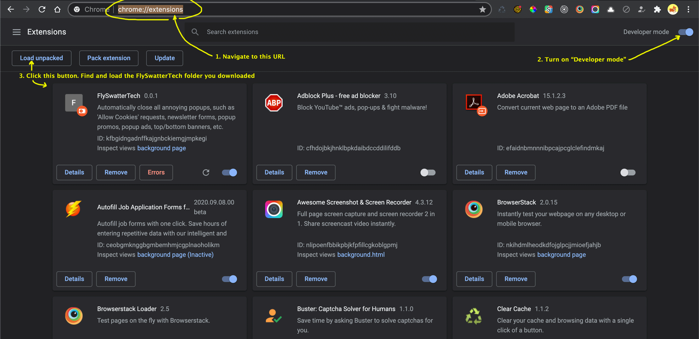
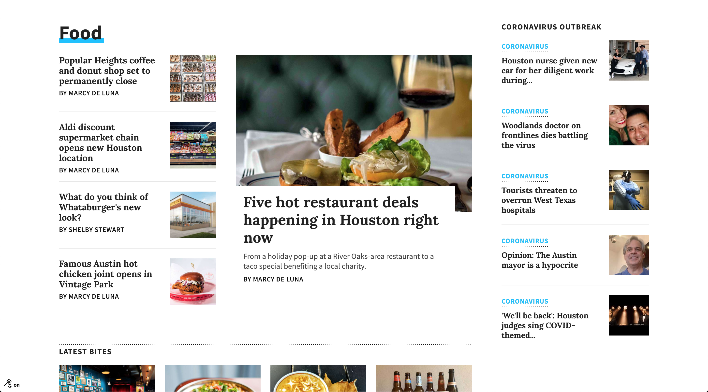
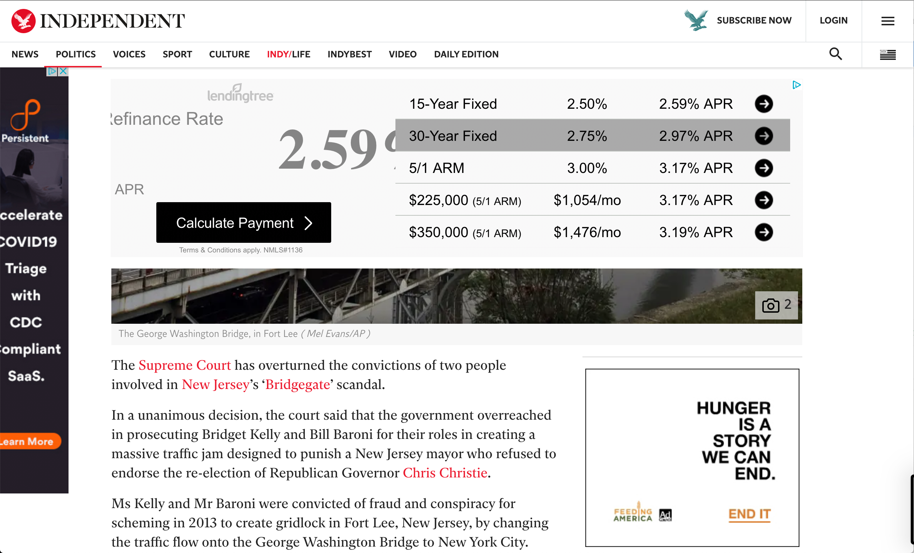
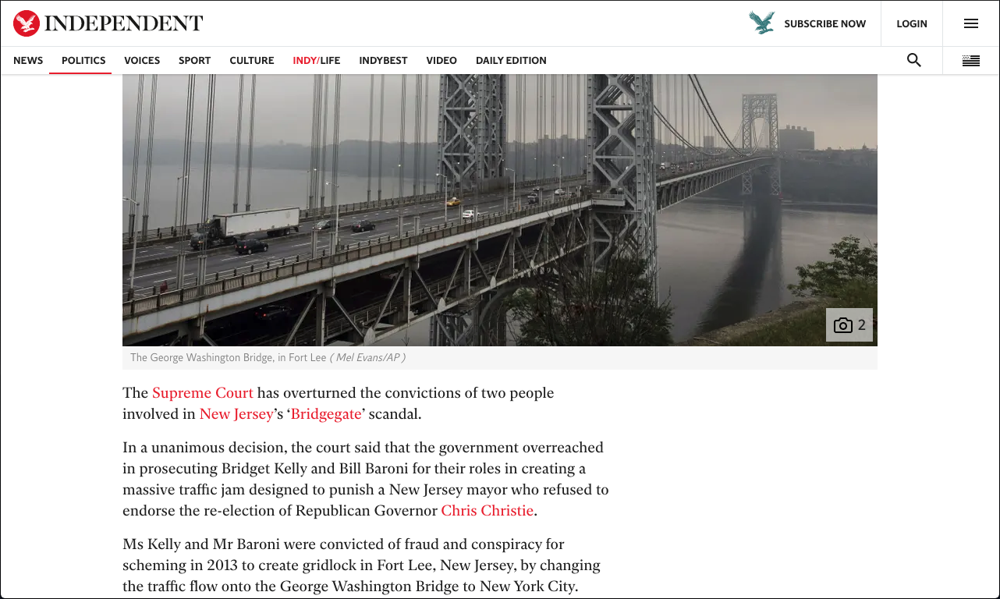
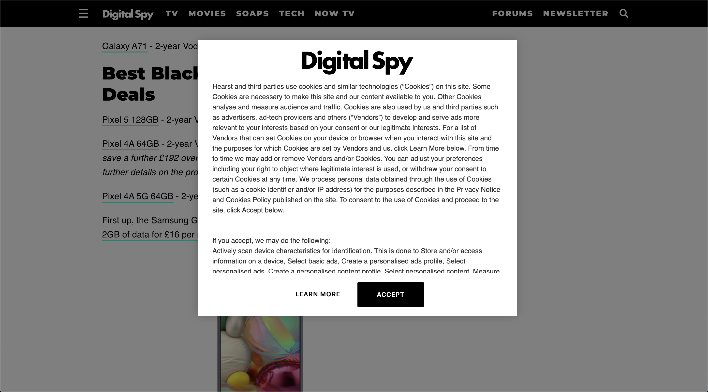
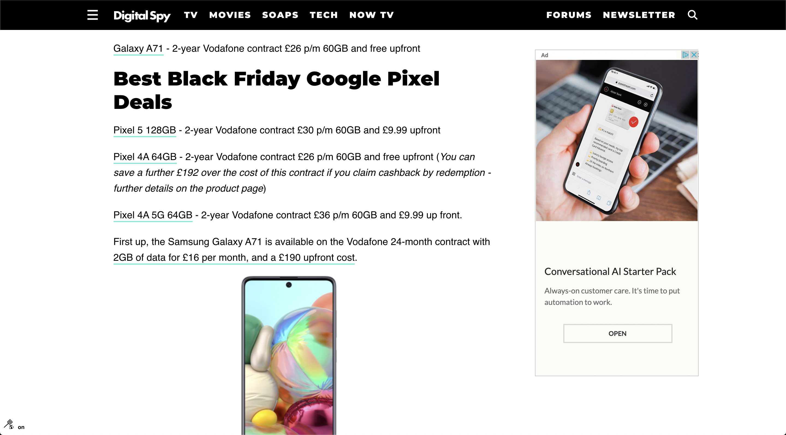
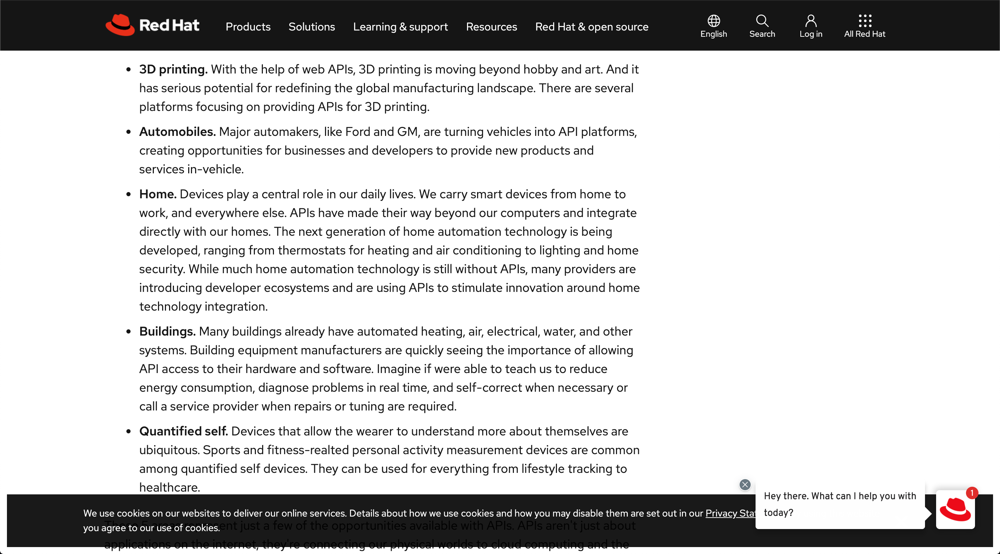
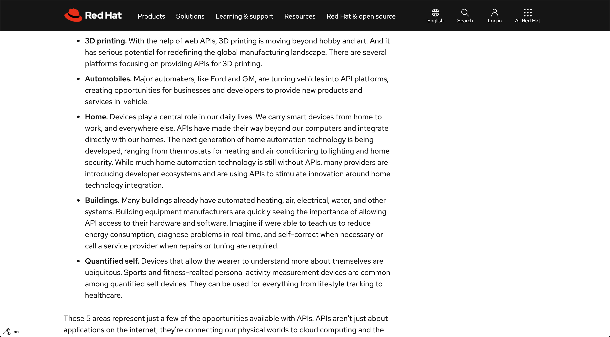

# Welcome

To a world where you can browse the web without being pestered by annoying popups, notifications, popup banners, consent buttons, cookies, terms, newsletters, etc.

No more "accept our cookies", "would you allow cookies?", "accept our terms and privacy policy", "sign up for our newsletter" in your face. I just want to get to the website content, without clicking and closing things first. Every site. It is so annoying. You're probably used to it. Anyway, it probably still contributes to subconscious frustration and makes you tired from browsing the web. It doesn't have to be like that.

I'm working on this browser extension, currently only for Chrome. If you'd like to contribute, please, let's get in touch!

# To install

Coming to Chrome store soon. For now, please install manually.

1. Download this entire Github folder. (Big green button "Code" above, then "Download ZIP")
2. 

# Examples

Before:

After:

Before:

After:

Before:

After:

Before:

After:

# To turn it off for a particular website/domain

Notice the little "fly and swatter" icon was added to the bottom left corner of your browser window. Click this to turn off the extension. Click it again to turn it back on. Etc.
